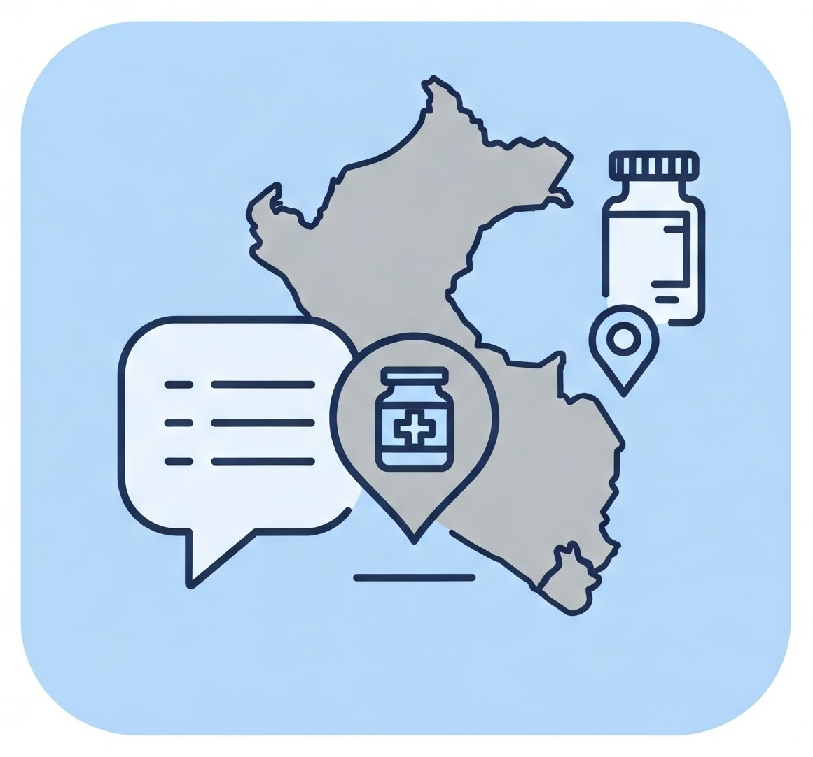

# MediFinder Web



A web application that serves as an intelligent chatbot interface for finding medication inventory information across healthcare centers in northwestern Peru. The application connects a Large Language Model (LLM) with a [Model Context Protocol (MCP)](https://modelcontextprotocol.org/) server to provide reliable and accurate information about medication availability.

## Features

- **Interactive Chat Interface**: User-friendly web UI for natural language queries about medications
- **LLM-Powered Responses**: Uses Anthropic's Claude AI model to understand queries and provide meaningful replies
- **MCP Tool Integration**: Leverages MCP server tools to query real-time medication databases
- **Live Response Streaming**: Streams AI responses in real-time with visible processing steps
- **Elegant Design**: Clean, responsive interface that works on both desktop and mobile devices

## System Architecture

MediFinder Web follows a modular architecture:

```
medifinder-web/
├── app/
│   ├── __init__.py          # Flask initialization
│   ├── config.py            # Centralized configuration
│   ├── mcp/
│   │   ├── __init__.py
│   │   └── client.py        # MCP Client
│   ├── llm/
│   │   ├── __init__.py
│   │   └── client.py        # Anthropic Client
│   ├── routes/
│   │   ├── __init__.py
│   │   └── main.py          # Application routes
│   ├── static/              # Static files
│   └── templates/           # HTML templates
├── .env                     # Environment variables
├── main.py                  # Entry point
├── tool_runner.py           # Thread handler
└── requirements.txt         # Dependencies
```

The application:
1. Receives user queries through the web interface
2. Sends queries to the Anthropic Claude LLM
3. The LLM analyzes the query and determines if tools from the MCP server are needed
4. If needed, the application executes MCP tool calls to fetch real-time medication data
5. Returns the comprehensive response to the user, showing both the final answer and the reasoning process

## Installation

### Prerequisites

- Python 3.9+
- Access to an Anthropic Claude API key
- A running MCP server with medication database tools

### Setup

1. Clone the repository:
   ```bash
   git clone https://github.com/yourusername/medifinder-web.git
   cd medifinder-web
   ```

2. Create and activate a virtual environment:
   ```bash
   python -m venv venv
   source venv/bin/activate  # On Windows: venv\Scripts\activate
   ```

3. Install dependencies:
   ```bash
   pip install -r requirements.txt
   ```

4. Create a `.env` file with your configuration (see Configuration section below)

5. Run the application:
   ```bash
   python main.py
   ```

6. Open your browser and navigate to `http://localhost:5000`

## Configuration

Create a `.env` file in the project root with the following variables:

```
# Flask Application
DEBUG=True
PORT=5000
HOST=0.0.0.0
SECRET_KEY=your-secret-key-here

# MCP Configuration
MCP_SERVER_PATH=/path/to/your/mcp/server/main.py
MCP_PYTHON_INTERPRETER=/path/to/your/python/interpreter

# Database Configuration
DB_HOST=localhost
DB_PORT=5432
DB_NAME=medifinderbot
DB_USER=db_username
DB_PASSWORD=db_password

# MCP App Configuration
ENV=development
DEBUG=True

# Search Configuration
MAX_SEARCH_RESULTS=50
SEARCH_SIMILARITY_THRESHOLD=0.3

# Anthropic Configuration
ANTHROPIC_API_KEY=your-anthropic-api-key
ANTHROPIC_MODEL=claude-3-5-sonnet-20241022
```

## Usage

1. Open the web interface in your browser
2. Type your question about medication availability in the chat input
3. The system will process your request and generate a response
4. During processing, you can see the thinking process including tool usage
5. The final response will contain information about medication availability based on your query

### Example Queries

- "¿Dónde puedo encontrar paracetamol en Huánuco?"
- "¿Cuál es el stock actual de ibuprofeno en centros de salud de Arequipa?"
- "¿Qué medicamentos para la presión arterial están disponibles en Tumbes?"
- "Necesito información sobre la disponibilidad de antibióticos en Ancash"

## API Endpoints

| Endpoint | Method | Description |
|----------|--------|-------------|
| `/` | GET | Main chat interface |
| `/api/chat` | POST | Submit a chat message and get streaming response |
| `/api/reset` | POST | Reset the conversation history |
| `/api/health` | GET | Check application health status |

## Development

### Extending the Application

To add new functionality:

1. Add new tool integrations in the MCP client
2. Update the LLM system prompt to inform about new capabilities
3. Add new API endpoints in the routes directory as needed

### Testing

Run tests with:
```bash
python -m unittest discover tests
```

## Troubleshooting

Common issues:

- **MCP Connection Failed**: Verify that your MCP server is running and accessible
- **LLM API Error**: Check your Anthropic API key and model availability
- **Missing Responses**: Enable DEBUG mode to see detailed logs

## License

This project is licensed under the MIT License - see the LICENSE file for details.

## Acknowledgments

- Built using [Model Context Protocol (MCP)](https://modelcontextprotocol.org/)
- Powered by [Anthropic Claude](https://www.anthropic.com/claude)
- Developed for improving medication accessibility in Peru
